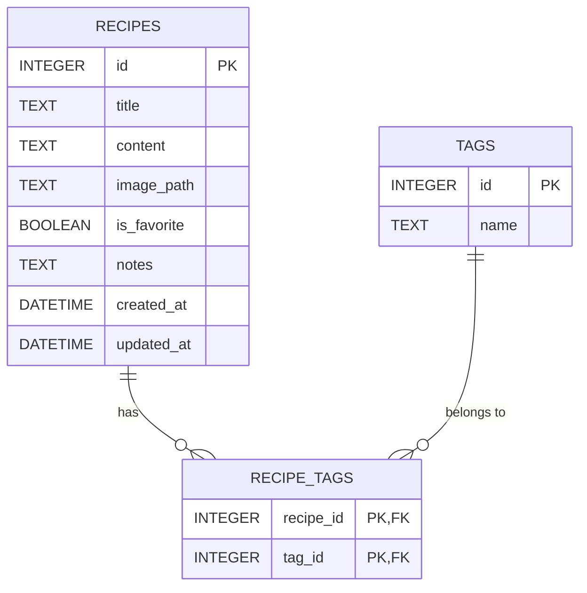

# 資料庫設計文件 (DB Design)

本文件描述食譜收藏系統的 SQLite 資料庫設計，包含實體關係圖 (ER 圖) 以及詳細的資料表結構說明。

## 1. 實體關係圖 (ER 圖)

## 2. 資料表詳細說明

### `recipes` (食譜表)

儲存每道食譜的主要資訊。包含標題、步驟內容、圖片路徑等。考量到 MVP 的設計，為了簡化查詢，「我的最愛」以及「烹飪筆記」皆作為欄位直接記錄於此表。

| 欄位名稱 | 資料型別 | 是否必填 | 說明 |
| :--- | :--- | :--- | :--- |
| `id` | `INTEGER` | 是 | Primary Key，自動遞增。 |
| `title` | `TEXT` | 是 | 食譜名稱。 |
| `content` | `TEXT` | 否 | 食譜的食材與步驟說明。 |
| `image_path` | `TEXT` | 否 | 儲存上傳圖片的相對路徑。 |
| `is_favorite` | `BOOLEAN` | 否 | 標記是否為我的最愛 (預設 0)。SQLite 中以 0 或 1 儲存。 |
| `notes` | `TEXT` | 否 | 使用者的烹飪筆記或改良心得。 |
| `created_at` | `DATETIME` | 是 | 建立時間 (預設 CURRENT_TIMESTAMP)。 |
| `updated_at` | `DATETIME` | 是 | 最後更新時間 (預設 CURRENT_TIMESTAMP)。 |

### `tags` (標籤表)

儲存系統中的所有標籤，如「中式」、「甜點」等。

| 欄位名稱 | 資料型別 | 是否必填 | 說明 |
| :--- | :--- | :--- | :--- |
| `id` | `INTEGER` | 是 | Primary Key，自動遞增。 |
| `name` | `TEXT` | 是 | 標籤名稱，設定為 UNIQUE，不可重複。 |

### `recipe_tags` (食譜標籤關聯表)

用於處理 `recipes` 與 `tags` 的多對多關聯關係。

| 欄位名稱 | 資料型別 | 是否必填 | 說明 |
| :--- | :--- | :--- | :--- |
| `recipe_id` | `INTEGER` | 是 | Foreign Key，對應 `recipes.id`。 |
| `tag_id` | `INTEGER` | 是 | Foreign Key，對應 `tags.id`。 |

> 註：此表使用 `(recipe_id, tag_id)` 作為 Composite Primary Key。並且設定 `ON DELETE CASCADE`，當食譜或標籤被刪除時，關聯記錄會一併刪除。
