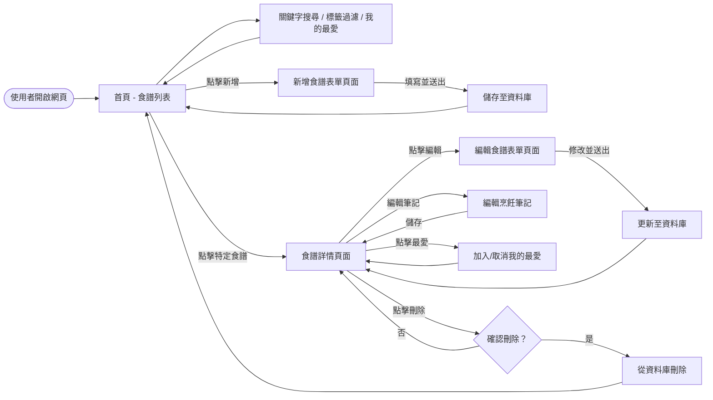
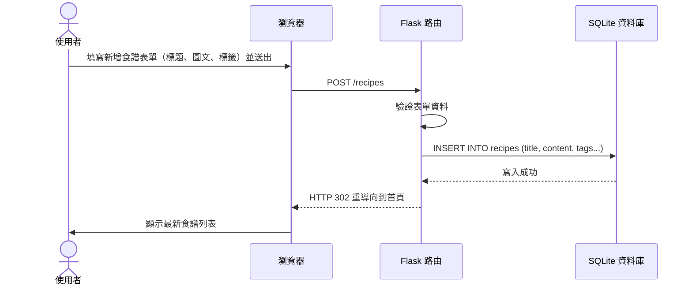

# 流程圖文件 (Flowchart)

根據 PRD (與 Flask + SQLite 架構規劃)，以下為食譜收藏系統的使用者流程圖與系統序列圖。

## 1. 使用者流程圖（User Flow）

此流程圖描述使用者從進入網站開始，主要功能的操作路徑與頁面跳轉邏輯。

## 2. 系統序列圖（Sequence Diagram）

此序列圖描述「使用者點擊新增食譜」到「資料存入資料庫」的完整後端資料流與互動流程。

## 3. 功能清單對照表

以下表格列出系統主要功能、對應的 URL 路徑與 HTTP 方法：

| 功能名稱 | 功能說明 | URL 路徑 | HTTP 方法 |
| :--- | :--- | :--- | :--- |
| **首頁 / 食譜列表** | 顯示所有食譜，支援關鍵字、標籤與最愛篩選 | `/` 或 `/recipes` | `GET` |
| **檢視食譜詳情** | 顯示特定食譜的完整圖文與烹飪筆記 | `/recipes/<id>` | `GET` |
| **新增食譜頁面** | 顯示新增食譜的空白表單 | `/recipes/new` | `GET` |
| **新增食譜處理** | 接收表單資料，寫入資料庫並處理圖片上傳 | `/recipes` | `POST` |
| **編輯食譜頁面** | 顯示編輯食譜的表單並帶入原有資料 | `/recipes/<id>/edit` | `GET` |
| **編輯食譜處理** | 接收修改後的表單資料，更新至資料庫 | `/recipes/<id>/edit` 或 POST 到特定路由 | `POST` |
| **刪除食譜** | 從資料庫刪除特定食譜與相關圖片 | `/recipes/<id>/delete` | `POST` |
| **新增/編輯筆記** | 更新特定食譜的烹飪筆記內容 | `/recipes/<id>/notes` | `POST` |
| **切換我的最愛** | 將特定食譜標記為最愛，或取消最愛標記 | `/recipes/<id>/favorite` | `POST` |

> 註：由於目前尚未找到 `docs/ARCHITECTURE.md`，上述流程與架構基於 PRD 中提及的 Flask、Jinja2 與 SQLite 預設實作模式進行設計。
